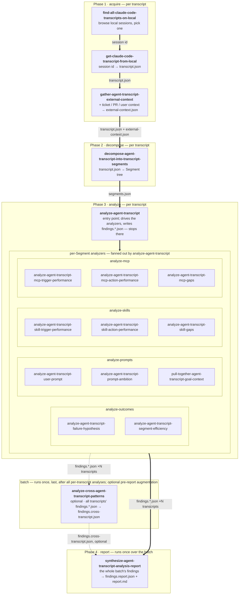

# `agent-transcript-analysis` skills

> This README is the human-maintained canonical spec for the plugin — closely reviewed, kept honest by hand. The individual `SKILL.md` files under each phase are largely generated by higher-level prompts and iterated over time. When a `SKILL.md` and this README disagree, **the README is the spec; the `SKILL.md` is an attempt to implement it** and should be reconciled back to here.

The full set of Skills bundled by the `agent-transcript-analysis` plugin. Used when someone wants a Claude Code session (or many of them) analyzed for what could have gone better — and what change to Skills / MCP servers / prompting habits would prevent it next time.

## Two layers: Transcript and Transcript Segment

Everything in this plugin operates on two layered data primitives, both defined by the `open-transcripts` reference set:

- **`Transcript`** — the OpenTranscripts wrapper. One JSON document per session, with `events[]`, recursive `subagents[]`, and metadata. Vendor-neutral. Phase 1 produces it from Claude Code's JSONL (see the `open-transcripts-claude-code-mapping` reference).
- **`TranscriptSegment`** — the analysis tree built over a Transcript. Trigger (kind × source), Goal, Outcome, children. Phase 2 produces it from a Transcript; phases 3+ consume only Segments.

The split means: a new vendor (Codex, Pi, Cursor) only needs a new mapping doc + transformation skill; the Segment tree and every analyzer downstream work unchanged.

## Per-transcript vs batch

Phases 1–3 run **per transcript**: acquire → decompose → analyze, ending at that transcript's `findings.{outcomes,prompts,skills,mcp}.json` set. The findings sets are the durable, accumulating substrate of the pipeline. You repeat phases 1–3 for every transcript you care about; the findings sets pile up, one set per transcript, each in its own transcript `tmp_dir`.

When the batch is complete — the user has no more transcripts to analyze — two **batch-level** steps run once each over the whole batch: `analyze-cross-agent-transcript-patterns` (optional, the last phase-3 step) and `synthesize-agent-transcript-analysis-report` (phase 4). Their artifacts land in a `batch_dir` — a batch-level working directory distinct from any single transcript's `tmp_dir`. `synthesize-agent-transcript-analysis-report` produces the one final report.

## How to run the pipeline

End-to-end, an operator does this:

1. **Pick a transcript.** Invoke `find-all-claude-code-transcripts-on-local` to browse local sessions and pick one. Skip this and jump to step 2 if you already have a Claude Code session id.
2. **Run the per-transcript spine.** For each transcript:
   - `get-claude-code-transcript-from-local` — session id → `transcript.json` in that transcript's `tmp_dir`.
   - `gather-agent-transcript-external-context` — pulls ticket / PR / user context into `external-context.json` next to it.
   - `decompose-agent-transcript-into-transcript-segments` — `transcript.json` → `segments.json` (+ flamegraph).
   - `analyze-agent-transcript` — entry point of phase 3; drives the per-Segment analyzers, writes `findings.outcomes.json`, `findings.prompts.json`, `findings.skills.json`, `findings.mcp.json` into the same `tmp_dir`. Stops there.
3. **Close the batch.** Repeat step 2 for every transcript you care about — findings sets accumulate, one set per `tmp_dir`. When the batch is complete:
   - Optionally `analyze-cross-agent-transcript-patterns` — reads every transcript's findings, writes `findings.cross-transcript.json` into the `batch_dir`.
   - `synthesize-agent-transcript-analysis-report` — reads the whole batch's findings (+ cross-transcript findings if present) from the `batch_dir`, writes `findings.report.json` and `report.md`.

Each skill's `SKILL.md` documents inputs, outputs, and the exact CLI shape — names in backticks above are clickable entries in `skills/skills.json`.

## What good output looks like

Per-phase signals that say the artifact is usable:

- **Phase 1 — acquire.** `transcript.json` validates clean against the `open-transcripts-transcript` schema, and `run.log` reports `validation: OK` with `unmapped_lines: 0` on a current Claude Code version (or a precise drift report when CC's format has moved — never a silent skip). `external-context.json` carries a `confidence` value and a `how_found` note on every populated block; missing sources are recorded as such. No fabricated ticket numbers or PR urls.
- **Phase 2 — decompose.** `segments.json` passes every rule in the `transcript-segment` reference: exactly one Trigger/Goal/Outcome per Segment, Trigger-kind consistency, full coverage of the transcript with no gaps or overlaps, deterministic ids, Outcomes resolved at the Segment they describe, every `evidence_event_ids` resolves to a real event in `transcript.json`. The tree should look like the worked example in spirit — coarse enough to read top-to-bottom, fine enough to surface real Goals.
- **Phase 3 — analyze.** Four `findings.<kind>.json` files in the envelope `{kind, items}`. Every item has a unique `id`, a real `segment_id`, and `evidence_event_ids` that resolve in `transcript.json`. No empty filler items — the skills and mcp analyzers omit themselves entirely when there's nothing to say. Spot-check: cited evidence actually supports the claim the finding makes.
- **Phase 4 — report.** `report.md` and `findings.report.json` agree on the same recommendation slate. Every `sources` id in `findings.report.json` resolves to a real finding in the batch's per-transcript files. Distance-from-ideal numbers (Failures / Corrections / wall-clock vs. human counterfactual) reconcile against `segments.json` and `findings.outcomes.json` independently. The leap from raw findings to prioritized recommendations is auditable through `sources` + `rationale` on each recommendation.

## Diagnosing problems / which phase owns the bug

Each phase's output is a draft you can re-run: if an artifact looks wrong, fix the phase that produced it and run that phase again. A short "if X looks wrong, the bug is likely in Phase Y" map:

- **A finding cites an event that doesn't exist or doesn't say what it claims.** Most likely an analyzer hallucination in Phase 3. But also check whether `segments.json`'s `evidence_event_ids` are correct (Phase 2) and whether `transcript.json` actually has the event (Phase 1) — the analyzer can only cite what decomposition handed it.
- **A `Compaction`-followed-by-`UserMessage` failure heuristic doesn't fire.** Check whether Phase 1 actually emits `Compaction` events at all — CC's `compact_boundary` system lines should map to an OpenTranscripts `Compaction` event, and if they're silently dropped the heuristic has nothing to bite on.
- **The report's distance-from-ideal numbers look wrong.** The source for Failures / Corrections / wall-clock is `segments.json` (Phase 2); the source for the human-counterfactual sum is `findings.outcomes.json` (Phase 3). Drift between them is a Phase-2 / Phase-3 disagreement, not a Phase-4 bug — `synthesize-agent-transcript-analysis-report` is just adding up what it was given.
- **Two transcripts' findings files have divergent id schemes.** Phase-3 orchestrator drift. The canonical item shape is stamped by the orchestrator (`analyze-agent-transcript`): `id` = `<analyzer-short-name>-<segment_id>`, evidence = event ids from `transcript.json`. If two `findings.*.json` sets disagree on the shape, the orchestrator on one of the runs went off-spec.

## How the skills interplay

The folder layout is numbered to mirror the pipeline phases — `tree` output reads top-to-bottom in execution order:

```
agent-transcript-analysis/
  1-acquire/              # phase 1: a session id → one transcript.json + its external context
    find-all-claude-code-transcripts-on-local/
    get-claude-code-transcript-from-local/      # session id → deterministic CC → OpenTranscripts mapping
    gather-agent-transcript-external-context/                    # pull the ticket / PR / user context into external-context.json
  2-decompose/            # phase 2: produce the Segment tree (segments.json + flamegraph)
    decompose-agent-transcript-into-transcript-segments/
  3-analyze/              # phase 3: orchestrator entry point + per-Segment analyzers (4 buckets) + cross-transcript
    analyze-agent-transcript/                   # the entry point: picks up segments.json, drives the analyzers, writes findings.*.json — stops there
    analyze-outcomes/         { analyze-agent-transcript-failure-hypothesis, analyze-agent-transcript-segment-efficiency }
    analyze-prompts/          { analyze-agent-transcript-user-prompt, analyze-agent-transcript-prompt-ambition,
                                pull-together-agent-transcript-goal-context }
    analyze-skills/           { trigger, action, gaps }
    analyze-mcp/              { trigger, action, gaps }
    analyze-cross-transcript/ { analyze-cross-agent-transcript-patterns }   # optional batch step: runs once, last, over the whole batch's findings
  4-report/               # phase 4: synthesize the whole batch's findings into the one final report
    synthesize-agent-transcript-analysis-report/                # the batch's findings.*.json (+ findings.cross-transcript.json) → findings.report.json + report.md
```

Phase 1 → 2 → 3 run per transcript; phase 4 runs once over the batch. Decomposition (phase 2) runs first and concretely; phase 3's entry point, `analyze-agent-transcript`, picks up `segments.json`, drives the per-Segment analyzers, and writes that transcript's `findings.*.json` set — and stops there. It has nothing to do with the report. You repeat phases 1–3 for every transcript in the batch. When the batch is complete, `analyze-cross-agent-transcript-patterns` runs once, last in phase 3, over all the analyzed transcripts' `findings.*.json` sets — an optional pre-report augmentation — and then `synthesize-agent-transcript-analysis-report` (phase 4) runs once over the whole batch's findings (plus `findings.cross-transcript.json` when present) to produce the single final report.

Numbered prefixes only land on grouping folders, never on Skill folders themselves — the Skills spec requires a Skill's folder name to match its `name`.

## Skill flow

How transcripts move through the skills, top to bottom. **The per-transcript spine — `FA ==> GET ==> GEC ==> DEC ==> ORCH ==> T3A` — runs once per transcript** and ends at that transcript's four `findings.*.json` files. There is no per-transcript report. **Thick arrows are the main spine**; the spine's end is the batch report, fed by every analyzed transcript's findings. **The one dotted arrow is the optional cross-transcript augmentation.** `analyze-cross-agent-transcript-patterns` and `synthesize-agent-transcript-analysis-report` are **batch-level steps that run once, after the batch is done** — edges feeding them carry `×N transcripts` to mark that they consume every transcript's findings, not one's. Every node is a registered Skill.



## Design decisions

- **Two data primitives, one downstream contract.** `Transcript` (phase 1 output) carries vendor-coupled detail; `TranscriptSegment` (phase 2 output) is the analysis tree. The downstream phases read only `segments.json` and dereference event ids back into `transcript.json` for evidence. If either is wrong, fix the producing phase and re-run — don't patch around it downstream.
- **OpenTranscripts is the cross-vendor contract.** Phase 1's output shape is governed by the `open-transcripts` reference set, not by any one vendor's JSONL. When CC changes its format, only the mapping doc + the transformation skill change.
- **External context is gathered once, up front.** A transcript records *what* the agent did; it rarely records *why*. Phase 1's `gather-agent-transcript-external-context` pulls the ticket, the PR, and light user context into one `external-context.json` that rides alongside `transcript.json` through every later phase — so no analyzer has to re-derive the Goal's backdrop. It is best-effort: missing sources are recorded, never fatal.
- **Numbered phases, not flat buckets.** The execution layers (acquire → decompose → analyze → report) are visible in the directory tree.
- **Grouping folders are never Skills.** `1-acquire/`, `2-decompose/`, `3-analyze/`, `4-report/`, and the per-domain buckets under phase 3 contain no `SKILL.md` of their own. That keeps the spec's "everything under a skill folder belongs to that skill" model intact.
- **The orchestrator is the analyze phase's entry point, not a phase of its own.** `analyze-agent-transcript` doesn't sit *between* decompose and analyze — it *is* the front door of the analyze phase. Decomposition (phase 2) runs first and concretely; the orchestrator picks up `segments.json`, fans out the four per-Segment buckets, and writes that transcript's `findings.*.json` set. It stops there — it does not touch the report. Giving orchestration its own phase number made it look like a pipeline stage that data flows *through*; it isn't one — it's the conductor of phase 3.
- **Per-transcript phases, one batch-final report.** Phases 1–3 run per transcript and end at `findings.*.json` — there is no per-transcript report. The findings sets accumulate, one per transcript. Once the batch is complete, `synthesize-agent-transcript-analysis-report` runs once over the whole batch's findings and produces the single final report. Synthesizing per transcript would bury the cross-session picture and force the reviewer through one report per session; one batch-final report keeps the recommendation slate deduped and prioritized across everything analyzed.
- **Four per-Segment phase-3 buckets, three output buckets.** `analyze-outcomes/` is Segment-shaped (failure hypotheses, efficiency); its findings *route* into the three artifact buckets (Prompting / Skills / MCP) via `recommendation_route`. `synthesize-agent-transcript-analysis-report` (phase 4) follows that route to fold the findings into a clean three-bucket report.
- **Labeling and synthesis are separate phases.** Phase 3 produces *findings* — flat lists of conclusions, per transcript. Phase 4 (`synthesize-agent-transcript-analysis-report`) makes the *leap* from the whole batch's findings to one prioritized, deduped recommendation slate. Splitting them keeps each phase independently re-runnable and isolates the most consequential interpretive step in its own phase — and the orchestrator never touches phase 4 at all.
- **Cross-transcript is phase-3 labeling, run last over the batch.** Patterns visible only at scale (recurring prompts, hindsight-as-foresight Segment shapes, time-spend trends) need many transcripts' findings as input — the per-transcript `findings.*.json` sets. It is still *labeling*, the same kind of work as the per-Segment buckets, so `analyze-cross-transcript/` lives in phase 3. But it is **batch-scoped**: it runs once, very last in phase 3, over all the analyzed transcripts' findings — not interleaved per transcript, not fanned out by the orchestrator. It is an optional pre-report augmentation: skip it and the report simply has no cross-transcript findings folded in; run it and its `findings.cross-transcript.json` feeds `synthesize-agent-transcript-analysis-report` alongside the per-transcript findings.
- **Folder hierarchy is for humans.** AIR resolves Skills via `skills.json`, which is flat. The nested folders exist so contributors can see the pipeline shape at a glance.
- **Philosophy docs are the tie-breaker.** The phase-3 analyzers consult the `philosophy-on-skills`, `philosophy-on-mcp`, and `philosophy-on-prompting` references as they draft findings — one per recommendation bucket (Skills, MCP, human prompting) — and `synthesize-agent-transcript-analysis-report` cross-checks every recommendation against the matching philosophy at the synthesis step, so the output stays consistent with team stance, not just per-Segment heuristics.
- **Local-first.** Nothing in this plugin uploads or phones home; all analysis happens against the local tmp folder.
