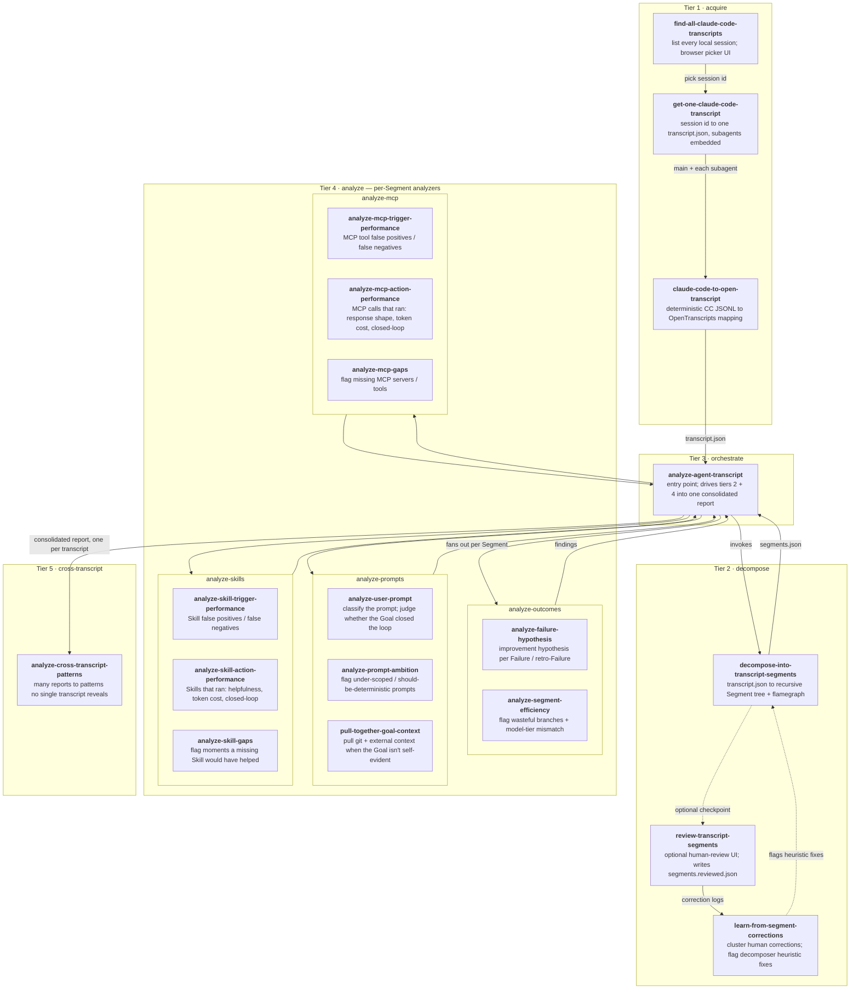

# `agent-transcript-analysis` skills

The full set of Skills bundled by the `agent-transcript-analysis` plugin. Used when someone wants a Claude Code session (or many of them) analyzed for what could have gone better — and what change to Skills / MCP servers / prompting habits would prevent it next time.

## Two layers: Transcript and Transcript Segment

Everything in this plugin operates on two layered data primitives, both defined by the `open-transcripts` reference set:

- **`Transcript`** — the OpenTranscripts wrapper. One JSON document per session, with `events[]`, recursive `subagents[]`, and metadata. Vendor-neutral. Tier 1 produces it from Claude Code's JSONL (see the `open-transcripts-claude-code-mapping` reference).
- **`TranscriptSegment`** — the analysis tree built over a Transcript. Trigger (kind × source), Goal, Outcome, children. Tier 2 produces it from a Transcript; tiers 3+ consume only Segments.

The split means: a new vendor (Codex, Pi, Cursor) only needs a new mapping doc + transformation skill; the Segment tree and every analyzer downstream work unchanged.

## How the skills interplay

The folder layout is numbered to mirror the orchestration tiers — `tree` output reads top-to-bottom in execution order:

```
agent-transcript-analysis/
  1-acquire/              # tier 1: pull a session + its subagents into one transcript.json
    find-all-claude-code-transcripts/
    get-one-claude-code-transcript/        # orchestrator
    claude-code-to-open-transcript/        # deterministic CC → OpenTranscripts mapping
  2-decompose/            # tier 2: produce the Segment tree (segments.json + flamegraph)
    decompose-into-transcript-segments/
  3-orchestrate/          # tier 3: drive fan-out and aggregation (single skill)
    analyze-agent-transcript/
  4-analyze/              # tier 4: per-Segment analyzers, four buckets
    analyze-outcomes/       { analyze-failure-hypothesis, analyze-segment-efficiency }
    analyze-prompts/        { analyze-user-prompt, analyze-prompt-ambition,
                              pull-together-goal-context }
    analyze-skills/         { trigger, action, gaps }
    analyze-mcp/            { trigger, action, gaps }
  5-cross-transcript/     # tier 5: aggregate many already-analyzed reports
    analyze-cross-transcript-patterns/
```

Tier 1 → 2 → 3 → 4. Tier 5 sits above all of them, consuming the outputs of many Tier 3 reports.

Numbered prefixes only land on grouping folders, never on Skill folders themselves — the Skills spec requires a Skill's folder name to match its `name`.

## Skill flow

How a transcript moves through the skills — every node is a registered Skill with a one-line description; edge labels are what flows between them.



## Design decisions

- **Two data primitives, one downstream contract.** `Transcript` (tier 1 output) carries vendor-coupled detail; `TranscriptSegment` (tier 2 output) is the analysis tree. Tiers 3-5 read only `segments.json` and dereference event ids back into `transcript.json` for evidence. If either is wrong, fix the producing tier and re-run — don't patch around it downstream.
- **OpenTranscripts is the cross-vendor contract.** Tier 1's output shape is governed by the `open-transcripts` reference set, not by any one vendor's JSONL. When CC changes its format, only the mapping doc + the transformation skill change.
- **Numbered tiers, not flat buckets.** The execution layers (acquire → decompose → orchestrate → analyze → cross-transcript) are visible in the directory tree.
- **Grouping folders are never Skills.** `1-acquire/`, `2-decompose/`, `3-orchestrate/`, `4-analyze/`, `5-cross-transcript/`, and the per-domain buckets under tier 4 contain no `SKILL.md` of their own. That keeps the spec's "everything under a skill folder belongs to that skill" model intact.
- **Four tier-4 buckets, three output buckets.** `analyze-outcomes/` is Segment-shaped (failure hypotheses, efficiency); its findings *route* into the three artifact buckets (Prompting / Skills / MCP) via `recommendation_route`. The final report keeps a clean three-bucket structure.
- **Cross-transcript is its own tier.** Patterns visible only at scale (recurring prompts, hindsight-as-foresight Segment shapes, time-spend trends) need many reports as input. Forcing that into the per-transcript orchestrator would muddy both.
- **Folder hierarchy is for humans.** AIR resolves Skills via `skills.json`, which is flat. The nested folders exist so contributors can see the orchestration shape at a glance.
- **Philosophy docs are the tie-breaker.** Every analyzer cross-checks its recommendation against the `philosophy-on-skills` and `philosophy-on-mcp` references so the output stays consistent with team stance, not just per-Segment heuristics.
- **Local-first.** Nothing in this plugin uploads or phones home; all analysis happens against the local tmp folder.
