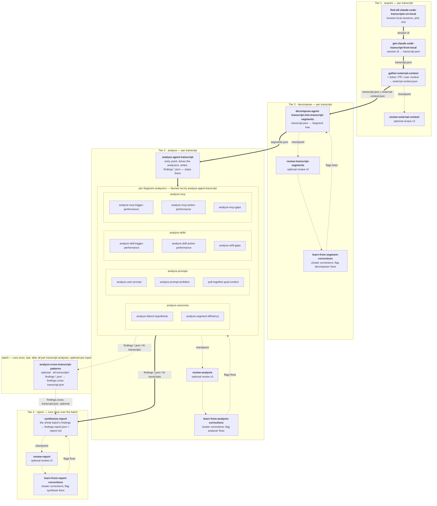

# `agent-transcript-analysis` skills

The full set of Skills bundled by the `agent-transcript-analysis` plugin. Used when someone wants a Claude Code session (or many of them) analyzed for what could have gone better — and what change to Skills / MCP servers / prompting habits would prevent it next time.

## Two layers: Transcript and Transcript Segment

Everything in this plugin operates on two layered data primitives, both defined by the `open-transcripts` reference set:

- **`Transcript`** — the OpenTranscripts wrapper. One JSON document per session, with `events[]`, recursive `subagents[]`, and metadata. Vendor-neutral. Tier 1 produces it from Claude Code's JSONL (see the `open-transcripts-claude-code-mapping` reference).
- **`TranscriptSegment`** — the analysis tree built over a Transcript. Trigger (kind × source), Goal, Outcome, children. Tier 2 produces it from a Transcript; tiers 3+ consume only Segments.

The split means: a new vendor (Codex, Pi, Cursor) only needs a new mapping doc + transformation skill; the Segment tree and every analyzer downstream work unchanged.

## Per-transcript vs batch

Tiers 1–3 run **per transcript**: acquire → decompose → analyze, ending at that transcript's `findings.{outcomes,prompts,skills,mcp}.json` set. There is no per-transcript report — the findings sets are the durable, accumulating substrate of the pipeline. You repeat tiers 1–3 for every transcript you care about; the findings sets pile up, one set per transcript, each in its own transcript `tmp_dir`.

When the batch is complete — the user has no more transcripts to analyze — two **batch-level** steps run once each over the whole batch: `analyze-cross-transcript-patterns` (optional, the last tier-3 step) and `synthesize-report` (tier 4). Their artifacts land in a `batch_dir` — a batch-level working directory distinct from any single transcript's `tmp_dir`. `synthesize-report` produces the one final report.

## How the skills interplay

The folder layout is numbered to mirror the pipeline tiers — `tree` output reads top-to-bottom in execution order:

```
agent-transcript-analysis/
  1-acquire/              # tier 1: a session id → one transcript.json + its external context
    find-all-claude-code-transcripts-on-local/
    get-claude-code-transcript-from-local/      # session id → deterministic CC → OpenTranscripts mapping
    gather-external-context/                    # pull the ticket / PR / user context into external-context.json
    review-external-context/                    # optional human-review UI for the gathered context
  2-decompose/            # tier 2: produce the Segment tree (segments.json + flamegraph) + review loop
    decompose-agent-transcript-into-transcript-segments/
    review-transcript-segments/                 # optional human-review UI over the Segment tree
    learn-from-segment-corrections/              # cluster review corrections; flag decomposer fixes
  3-analyze/              # tier 3: orchestrator entry point + per-Segment analyzers (4 buckets) + cross-transcript + review loop
    analyze-agent-transcript/                   # the entry point: picks up segments.json, drives the analyzers, writes findings.*.json — stops there
    analyze-outcomes/         { analyze-failure-hypothesis, analyze-segment-efficiency }
    analyze-prompts/          { analyze-user-prompt, analyze-prompt-ambition,
                                pull-together-goal-context }
    analyze-skills/           { trigger, action, gaps }
    analyze-mcp/              { trigger, action, gaps }
    analyze-cross-transcript/ { analyze-cross-transcript-patterns }   # optional batch step: runs once, last, over the whole batch's findings
    review-analysis/                  # human-review UI over any findings.<kind>.json draft
    learn-from-analysis-corrections/  # cluster review corrections; flag tier-3 analyzer fixes
  4-report/               # tier 4: synthesize the whole batch's findings into the one final report + review loop
    synthesize-report/                # the batch's findings.*.json (+ findings.cross-transcript.json) → findings.report.json + report.md
    review-report/                    # optional human-review UI over the recommendation slate
    learn-from-report-corrections/    # cluster review corrections; flag synthesize-report fixes
```

Tier 1 → 2 → 3 run per transcript; tier 4 runs once over the batch. Decomposition (tier 2) runs first and concretely; tier 3's entry point, `analyze-agent-transcript`, picks up `segments.json`, drives the per-Segment analyzers, and writes that transcript's `findings.*.json` set — and stops there. It has nothing to do with the report. You repeat tiers 1–3 for every transcript in the batch. When the batch is complete, `analyze-cross-transcript-patterns` runs once, last in tier 3, over all the analyzed transcripts' `findings.*.json` sets — an optional pre-report augmentation — and then `synthesize-report` (tier 4) runs once over the whole batch's findings (plus `findings.cross-transcript.json` when present) to produce the single final report.

Numbered prefixes only land on grouping folders, never on Skill folders themselves — the Skills spec requires a Skill's folder name to match its `name`.

## Skill flow

How transcripts move through the skills, top to bottom. **The per-transcript spine — `FA ==> GET ==> GEC ==> DEC ==> ORCH ==> T3A` — runs once per transcript** and ends at that transcript's four `findings.*.json` files. There is no per-transcript report. **Thick arrows are the main spine**; the spine's end is the batch report, fed by every analyzed transcript's findings. **Dotted arrows are the side loops** — each tier's optional human-review checkpoint, the `learn-from-*-corrections` edge that feeds corrections back to the draft generator, and the optional cross-transcript augmentation. `analyze-cross-transcript-patterns` and `synthesize-report` are **batch-level steps that run once, after the batch is done** — edges feeding them carry `×N transcripts` to mark that they consume every transcript's findings, not one's. Every node is a registered Skill.



## Design decisions

- **Two data primitives, one downstream contract.** `Transcript` (tier 1 output) carries vendor-coupled detail; `TranscriptSegment` (tier 2 output) is the analysis tree. The downstream tiers read only `segments.json` and dereference event ids back into `transcript.json` for evidence. If either is wrong, fix the producing tier and re-run — don't patch around it downstream.
- **OpenTranscripts is the cross-vendor contract.** Tier 1's output shape is governed by the `open-transcripts` reference set, not by any one vendor's JSONL. When CC changes its format, only the mapping doc + the transformation skill change.
- **External context is gathered once, up front.** A transcript records *what* the agent did; it rarely records *why*. Tier 1's `gather-external-context` pulls the ticket, the PR, and light user context into one `external-context.json` that rides alongside `transcript.json` through every later tier — so no analyzer has to re-derive the Goal's backdrop. It is best-effort (missing sources are recorded, never fatal) and has `review-external-context` as its optional human checkpoint, mirroring tier 2's `review-transcript-segments`.
- **Numbered tiers, not flat buckets.** The execution layers (acquire → decompose → analyze → report) are visible in the directory tree.
- **Grouping folders are never Skills.** `1-acquire/`, `2-decompose/`, `3-analyze/`, `4-report/`, and the per-domain buckets under tier 3 contain no `SKILL.md` of their own. That keeps the spec's "everything under a skill folder belongs to that skill" model intact.
- **The orchestrator is the analyze tier's entry point, not a tier of its own.** `analyze-agent-transcript` doesn't sit *between* decompose and analyze — it *is* the front door of the analyze tier. Decomposition (tier 2) runs first and concretely; the orchestrator picks up `segments.json`, fans out the four per-Segment buckets, and writes that transcript's `findings.*.json` set. It stops there — it does not touch the report. Giving orchestration its own tier number made it look like a pipeline stage that data flows *through*; it isn't one — it's the conductor of tier 3.
- **Per-transcript tiers, one batch-final report.** Tiers 1–3 run per transcript and end at `findings.*.json` — there is no per-transcript report. The findings sets accumulate, one per transcript. Once the batch is complete, `synthesize-report` runs once over the whole batch's findings and produces the single final report. Synthesizing per transcript would bury the cross-session picture and force the reviewer through one report per session; one batch-final report keeps the recommendation slate deduped and prioritized across everything analyzed.
- **Four per-Segment tier-3 buckets, three output buckets.** `analyze-outcomes/` is Segment-shaped (failure hypotheses, efficiency); its findings *route* into the three artifact buckets (Prompting / Skills / MCP) via `recommendation_route`. `synthesize-report` (tier 4) follows that route to fold the findings into a clean three-bucket report.
- **Labeling and synthesis are separate tiers.** Tier 3 produces *findings* — flat lists of conclusions, per transcript. Tier 4 (`synthesize-report`) makes the *leap* from the whole batch's findings to one prioritized, deduped recommendation slate. Splitting them gives the leap its own review checkpoint (`review-report`) and learn loop (`learn-from-report-corrections`) — the same draft → review → learn shape tiers 2 and 3 already have — and the orchestrator never touches tier 4 at all.
- **Cross-transcript is tier-3 labeling, run last over the batch.** Patterns visible only at scale (recurring prompts, hindsight-as-foresight Segment shapes, time-spend trends) need many transcripts' findings as input — the per-transcript `findings.*.json` sets. It is still *labeling*, the same kind of work as the per-Segment buckets, so `analyze-cross-transcript/` lives in tier 3. But it is **batch-scoped**: it runs once, very last in tier 3, over all the analyzed transcripts' findings — not interleaved per transcript, not fanned out by the orchestrator. It is an optional pre-report augmentation: skip it and the report simply has no cross-transcript findings folded in; run it and its `findings.cross-transcript.json` feeds `synthesize-report` alongside the per-transcript findings.
- **Folder hierarchy is for humans.** AIR resolves Skills via `skills.json`, which is flat. The nested folders exist so contributors can see the pipeline shape at a glance.
- **Philosophy docs are the tie-breaker.** The tier-3 analyzers consult the `philosophy-on-skills` and `philosophy-on-mcp` references as they draft findings, and `synthesize-report` cross-checks every recommendation against them at the synthesis step — so the output stays consistent with team stance, not just per-Segment heuristics.
- **Local-first.** Nothing in this plugin uploads or phones home; all analysis happens against the local tmp folder.
